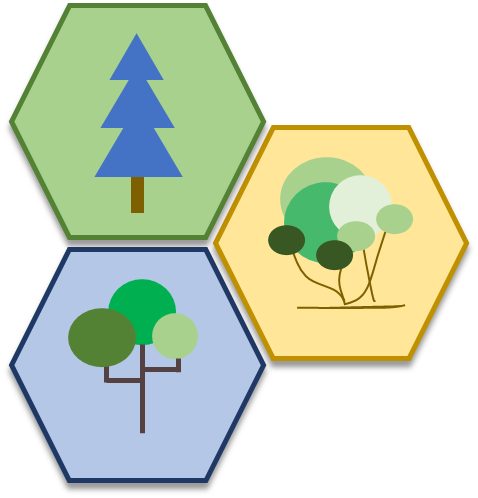
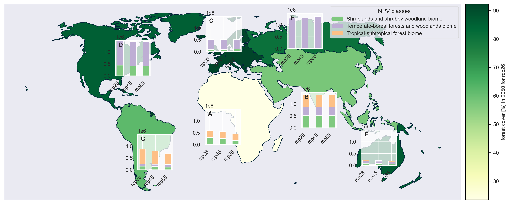
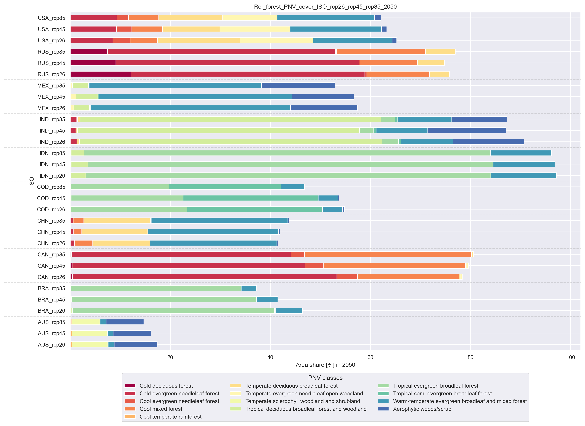

# Country-specific calculation of potential forest area (PFA)



------------

- [Cite the PFA project](#cite-the-pfa-project)
- [Install the PFA project](#install-the-pfa-project)
  - [Doublecheck installation](#doublecheck-installation-and-test-suite)
- [Use the PFA project](#use-the-pfa-project)
  - [Project settings](#project-settings)
- [Extended project description](#extended-project-description)
- [Roadmap and project status](#roadmap-and-project-status)
- [Contributing to the project](#contributing-to-the-project)
- [Authors](#authors)
- [Contribution statement](#contribution-statement)
- [License and Copyright Note](#license-and-copyright-note)
- [Acknowledgements](#acknowledgements)
- [References](#references)

## Cite the PFA project

We are happy that you use your project and data for your research. When publishing your work in articles, working papers, 
presentations or elsewhere, please cite the project as:

[Tandetzki, J. and Honkomp, T. (2024). Country-specific calculation of potential forest area](CITATION.cff)

## Install the PFA project

The package was developed and tested using Python 3 (Python 3.9.7 and Python 3.12.6) version on Windows.
Before proceeding, please ensure that Python is installed on your system. It can be downloaded and installed 
from [Python.org](https://www.python.org/downloads/).

1. Clone the repository
Begin by cloning the repository to your local machine using the following command: 
    >git clone https://github.com/TI-Forest-Sector-Modelling/PFA
2. Switch to the PFA directory  
Navigate into the PFA project folder on your local machine.
   >cd PFA

3. Create a virtual environment  
It is recommended to set up a virtual environment (venv) for the PFA project to manage dependencies. The package is tested using
Python >3.9 (3.9.7 and 3.12.6). With a newer Python version, we can not guarantee the full functionality of the package.
Select the correct Python interpreter.   
   Show installed versions: 
   >py -0  

   - If you have installed multiple versions of Python, activate the correct version using the py-Launcher.
   >py -3.9 -m venv venv 
   > 
   >py -3.12 -m venv venv 
 
   - If you are using only a single version of Python on your computer:
   >python -m venv venv

4. Activate the virtual environment  
Enable the virtual environment to isolate PFA dependencies. 
   >venv\Scripts\activate
   > 
5. Install PFA project requirements  
Install all required PFA dependencies listed in the requirements.txt file.
   >pip install -r requirements.txt

6. Install PFA in the editable mode  
   >pip install -e .

If the following error occurs: "ERROR: File "setup.py" or "setup.cfg" not found."
you might need to update the pip version you use with: 
>python.exe -m pip install --upgrade pip


### Doublecheck installation and test suite
The PFA package comes with a test suite to ensure its functionality.
Run the test suite to check the functionality of the package:

  > coverage run

or 
 > $python -m unittest discover -s test


To reduce the test suite running time, only the data for 6 classes are tested. The test suite results will not be saved.
The aggregated data are validated using the WDI land surface comparing both land surface data with a relative tolerance of 5%.  

The coverage report of the PFA project can be accessed using:
 > coverage report


## Use the PFA project
For more information about the raw, preprocessed and output data refer to the readme written in each folder.  

```bash
.
`- data input
  `-- raw #data .tif files from **Bonannella et al. (2023) available at [zenodo](https://zenodo.org/records/7822868)
  `-- preprocessed #reform data to epsg.8857 coordinate system
  `-- outputs #shows worldmap.png data and pnv data for 6 (IUCN) and 20 (6K biome) different vegetation classes for different countries. 
 ```
The package generates output in the folder data and output. Output is provided for the data regarding country-specific area 
processing (xlsx and pkl and simple maps) and validation figures (comprehensive world maps with figures).

```bash
 `- data output
  `-- ...6 or 20_class_combined.xlsx # output data for all classes (6 or 20) and every country and scenario 
  `-- ...6 or 20_class_combined.pkl # same structure as Excel data
  `-- ...6 or 20_class_different_sheets.xlsx # output data for all classes (6 or 20) and every country and  every scenario on different Excel sheets
  `-- ...PNV processing.log # logging information and data
  `-- biome6k_hcl_rcp...._year.png # related .png file for every .tif file
  `-- ...test_test_output.png # test validation figure #Todo: rename of output?
  `-- PNV_world_map_6 or 20 classes_rcp26_45_85.png # comprehensive validation output
```

### Project settings
There are various setting options within the model. The user input allows for various settings to be configured. By 
default, there are 6 classes, and preprocessing is set to True. Preprocessing should remain True if the .tif files have 
not yet been processed into the desired coordinate system. In the first step, the processing of the TIF files takes place. 
Data is read and stored in the preprocessed directory. Additionally, the calculation of country-specific areas is performed 
depending on the class. The data is then stored in Excel and PKL files, as well as a simple world map in PNG format.

In the second step, the processed data is validated and visualized. This occurs in the toolbox. The final output of the 
package consists of various figures that allow for the validation of future potential forest areas under different RCPs.
Users can adapt model settings by changing entries in default_parameters.py.

#### PFA:
- A flag to process the required coordinate system (epsg.8857)
- A flag to change between the number of classes and biomes, respectively [default: 6 classes]
 
#### Toolbox:  
The toolbox offers a large range of settings to adapt the analysis to the user's needs:
- 'SELECT_PNV_CLASS': Allows to control the number of biome classes processed [default: 6 classes]
- 'SELECT_YEAR': Allows to control the selected year for which data will be plotted [options: 2013 to 2080]
- 'SELECT_RCP': List of selected rcp for which data will be plotted [options: 'rcp26', 'rcp45', 'rcp85']
- 'SELECT_AGG_LVL': Allows to control the selected aggregation level which will be used for spatial aggregation [options: 'continents', 'fao_regions', 'country']
- 'SELECT_ISO': Allows to control the selected country ISO code which data will be plotted [options: 'any ISO3-list', 'big_n', 'continent name']. 
    - The 'any ISO3-list' Option shows all countries in the list of ISO3 codes (e.g., ['GER', 'FRA', 'SWE'] 
    - The 'big_n' Option shows the countries with the n-largest forest area (e.g., ['big_10'] or ['big_5'])
    - The 'continent name' Option shows all countries within the selected continent (e.g. ['South America'] or ['Asia'])
- 'PAPER_FORMAT': Allows to control the font size in figures
- 'SAVE_FIGURE': Controls if the figures are saved in the output directory
- 'OUTPUT_NAME': Name of output file

## Extended project description
This model processes potential natural vegetation area data published by Bonannella et al. (2023). The data 
encompass different classes of global biomes 6000 at a cross-spatial level. The historical data (1979-2013) from Bonannella 
et al. were calibrated and projected under three different climate scenarios (RCP 2.6, 4.5, and 8.5) for the 
distribution of future biomes over the periods 2040-2060 and 2061-2080. We use this data as an example to create a model 
that processes the spatial resolution TIF files and subsequently outputs the results by country for each biome category. 

The model outputs include country-specific data for each climate scenario, global maps as PNG files, and a comprehensive 
toolbox for visualizing changes in potential natural vegetation areas across the various periods and climate scenarios. This visualization 
distinguishes between aggregated data and individual country data. Additionally, it is possible to compare potential natural vegetation 
areas with World Bank country land data, allowing for the interpretation and validation of the results. 

The following figure depicts an example of global analyses obtained with 6 classes and 3 RCPs in 2050 (default_parameters.py).
Further, the following function parameters were used:
> pnv_analysis.pnv_world_map(fig_option='bar_chart', winkel_reproject=False, dissolve_map_regions=True)


**Figure 1**: World map of regional aggregated potential natural vegetation data. The foreground subplots show the distribution
of forest-related PNV data [10³ ha] in the respective region for the selected RCPs. The background map depicts the potential
land cover share [%] where forest-related PNV classes could be established in 2050 in the scenario RCP2.6.

Comparisons of aggregated PNV data between single countries, regions or continents can be visualized using bar plots.
The following figure depicts the share of land where forest-related PVN classes could potentially be established across 
continental aggregates. Underlying data are processed from 6 classes and 3 RCPs in 2050. 

The following parameters were used:
> pnv_analysis.pnv_bar_plot(plot_option='rel', aggregated_forest=False)

 

**Figure 2**: Barplot of continental aggregated potential natural vegetation data. Aggregated data are depicted as the 
potential land cover share [%] where forest-related PNV classes could be established in 2050 in the scenario 
RCP2.6, 4.5, and 8.5.


## Roadmap and project status
The development of the PFA project is ongoing. Future releases will integrate climate-sensitive projections for agricultural land use.

## Contributing to the project
We welcome contributions, extensions, and adjustments to further develop the project and improve both the code, and the model
itself. We also welcome the expansion of the project through the addition of new datasets and its dynamization. You can contact 
us directly via GitHub by creating issues or via email.

wf-timba@thuenen.de, [Julia Tandetzki](julia.tandetzki@thuenen.de), [Tomke Honkomp](tomke.honkomp@thuenen.de)

## Authors
- [Julia Tandetzki](https://www.thuenen.de/en/fachinstitute/waldwirtschaft/personal/wissenschaftliches-personal/julia-tandetzki-msc) ([ORCID 0000-0002-0630-9434](https://orcid.org/0000-0002-0630-9434), [GitHub](https://github.com/Julia-ta)) and 
- [Tomke Honkomp](https://www.thuenen.de/en/fachinstitute/waldwirtschaft/personal/wissenschaftliches-personal/tomke-honkomp-msc) ([ORCID 0000-0002-6719-0190](https://orcid.org/0000-0002-6719-0190), [GitHub](https://github.com/tomkeH)). 

## Contribution statement
| Author            | Conceptualization and theoretical framework | Methodology | Data Curation and Management | Formal Analysis | Programming | Writing and Documentation | Visualization | Review and Editing |
|:------------------|:-------------------------------------------:|:-----------:|:----------------------------:|:---------------:|:-----------:|:-------------------------:|:-------------:|:------------------:|
| Julia Tandetzki   |                      X                      |      X      |              X               |        X        |      X      |             X             |       X       |         X          | 
| Tomke Honkomp     |                      X                      |      X      |              X               |        X        |      X      |             X             |       X       |         X          |

## License and copyright note

Licensed under the GNU AGPL, Version 3.0. 

Copyright ©, 2024, Thuenen Institute.

 This program is free software: you can redistribute it and/or modify
 it under the terms of the GNU Affero General Public License as
 published by the Free Software Foundation, either version 3 of the
 License, or (at your option) any later version.

 This program is distributed in the hope that it will be useful, but
 WITHOUT ANY WARRANTY; without even the implied warranty of
 MERCHANTABILITY or FITNESS FOR A PARTICULAR PURPOSE.  See the GNU
 Affero General Public License for more details.

 You should have received a copy of the GNU Affero General Public
 License along with this program.  If not, see
 <https://www.gnu.org/licenses/agpl-3.0.txt>.
 
## Acknowledgements
This work has benefited from the support of [Dr. Andreas Kempe](https://www.thuenen.de/en/fachinstitute/waldwirtschaft/personal/wissenschaftliches-personal/dr-andreas-kempe) related to processing geospatial data.
We also thank Carmelo Bonannella for the kind introduction to the available data and the valuable exchange. 
Special thanks go to the entire TI-FSM author collective, especially Franziska Schier and Christian Morland, for their trustworthy collaboration,
critical discussions, and helpful comments.

## References

Bonannella, Carmelo; Hengl, Tomislav; Parente, Leandro; Bruin, Sytze de (2023): Biomes of the world under climate change scenarios: increasing aridity and higher temperatures lead to significant shifts in natural vegetation. In: PeerJ 11, e15593. DOI: 10.7717/peerj.15593.