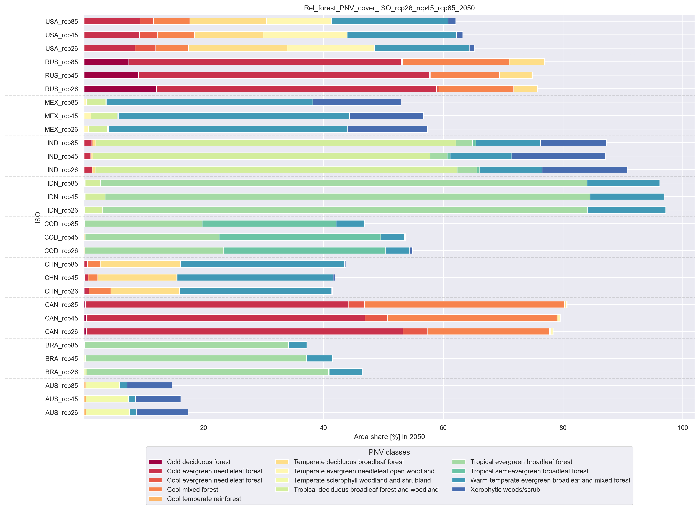

# Summary
This package processes the model outputs from @Bonannella:2023, which provide spatially detailed global projections of potential natural
vegetation (PNV) areas under three different climate change scenarios (RCP 2.6, 4.5, and 8.5) [@van Vuuren:2011] until 2080 [@Bonnanella:2023]. 
We focus on processing these results (using TIFF files) to derive forest area estimates at the country level. The package begins with aggregating
the data by country and adjusting forest definitions to match biome types and IUCN classifications, as provided in the dataset under PNV areas.
The projections are converted to EPSG 8857 and then clipped with country data provided by geopandas at a 1x1 km pixel resolution.
This allows us to derive country-specific areas in km². A toolbox is included to validate the results with alternative datasets (e.g., WDI). The 
package offers flexibility, enabling users to analyze not only the @Bonanella:2023 data but also other spatial maps using Python. Additionally, we 
examine how forest areas within countries and continents change up to 2080, focusing on both increases and decreases across various time frames. This tool
can support long-term international forest and policy modelling, similar to other projects that leverage complex datasets for future scenario 
analysis.

[comment]: <> (Quelle für WDI Daten müssten wir noch einfügen)

# Statement of need
Forests provide irreplaceable ecosystem services, such as biodiversity conservation, habitat provision, and carbon storage [@Nabuurs:2023]. Climate change
scenarios exert additional pressure on forests, making it critical to understand their future development and shapes. To gain insights into these dynamics,
reliable data is essential - data that increasingly comes from satellite imagery. Spatially explicit projections play a central role in 
depicting forest development, particularly when considering future trends. For policymaking implications, projecting the global
forest area is crucial to understanding future forest dynamics. Additionally, in the context of land-use conflicts, such as between agricultural and forest land, accurately representing the future state of forests is essential. [@Bousfield:2024;@Schneider:2022]
However, spatially explicit forest data is not always easily accessible to users, especially when conducting global analyses across different countries. This package overcomes this barrier by using data 
provided by @Bonannella:2023 to evaluate spatially explicit forest data, organized at the country level, with projections extending to 2080. 

# Package design
The package is divided into two parts. In the first step, data is processed in and converted into a suitable coordinate system (we use equal earth map projection EPSG:8857).
Subsequently, the pixels are counted, enabling the precise conversion of areas in km². Each pixel is sorted according to the respective vegetation classes (IUCN) or biomes. 
In this part, the calculation of PNV data per country is also performed. For better clarity, world maps are delivered in .png format. 
In the second step, the extracted data is validated and processed using the toolbox. Cross-validation is carried out between aggregated spatial explicit data and WDI land surface data
across climate scenarios and time periods. 

**Figure 1**: PFA package workflow.

# Examples
The toolbox provides a built-in solution for rapid analyses, providing an overview of the data in the geographical resolution of interest.
The toolbox allows to conduct national, regional, or global analyses of processed remote sensing data and visualise the result: 
- The provided barplot option is designed for national, regional, or global analyses.
- The provided world map option enables users to conduct global analyses.

The toolbox can be started from the main entry point (plot_fig=True) or the data_analysis.py. However, the second
option offers a larger range of parameters to adapt the analysis to the user's needs. 

The following figure depicts an example of global analyses obtained with 6 classes and 3 RCPs in 2050 (default_parameters.py).
Further, the following function parameters were used:
> pnv_analysis.pnv_world_map(fig_option='bar_chart', winkel_reproject=False, dissolve_map_regions=True)

**Figure 2**: World map of regional aggregated potential natural vegetation data. The foreground subplots show the distribution
of forest-related PNV data [10³ ha] in the respective region for the selected RCPs. The background map depicts the potential land cover share [%] where forest-related PNV classes could be established.

Comparisons of aggregated PNV data between single countries, regions or continents can be visualized using bar plots.
The following figure depicts the share of land where forest-related PVN classes could potentially be established across 
continental aggregates. Underlying data are processed from 6 classes and 3 RCPs in 2050. 

The following parameters were used:
> pnv_analysis.pnv_bar_plot(plot_option='rel', aggregated_forest=False)

 

**Figure 3**: Barplot of continental aggregated potential natural vegetation data. Aggregated data are depicted as the 
potential land cover share [%] where forest-related PNV classes could be established in 2050 in the scenario 
RCP2.6, 4.5, and 8.5.

# Acknowledgements
We acknowledge the fruitful discussions with Andreas Kempe regarding the idea and, in particular, the exchange about the coordinate system.
We also thank Carmelo Bonannella for the kind introduction to the available data and the valuable exchange. 
Special thanks go to the entire TI-FSM author collective, especially Franziska Schier and Christian Morland, for their trustworthy collaboration,
critical discussions, and helpful comments.

# References